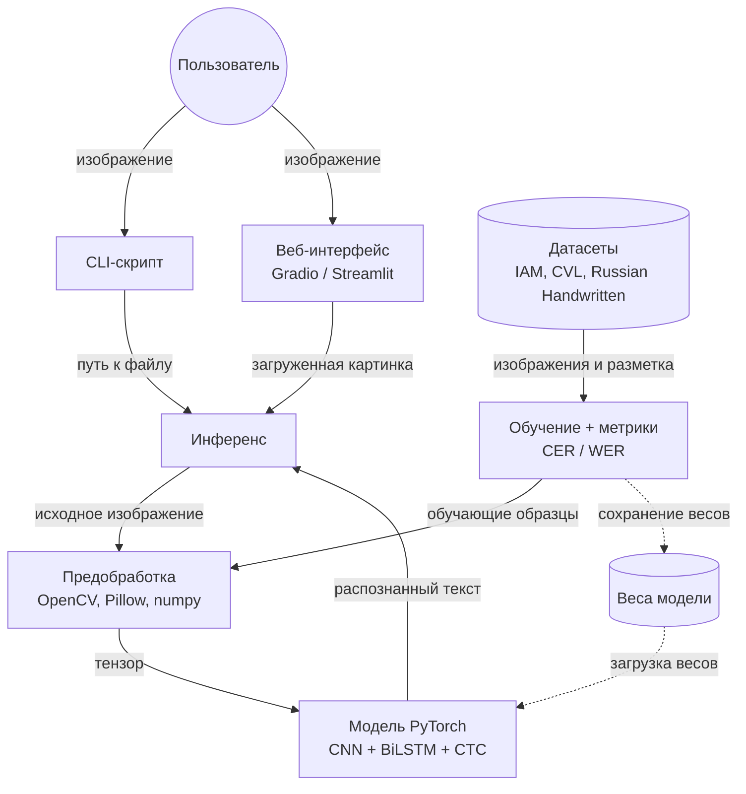
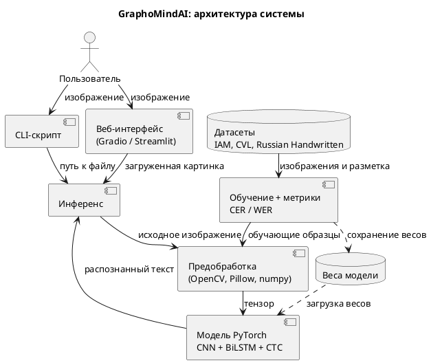

# GraphoMindAI: архитектура системы

**GraphoMindAI** — система распознавания рукописного текста (HTR, Handwritten Text Recognition). Пользователь загружает фотографию или скан с рукописным текстом, а система возвращает этот текст в печатном виде.

Этот документ объясняет, из каких частей состоит система и как они связаны. Он написан так, чтобы его понял человек, который видит проект впервые.

## Схема

**Как читать схему.** Сплошная стрелка означает передачу данных или вызов, пунктирная означает загрузку или сохранение файла. Подпись на стрелке говорит, что именно передаётся.

В системе два независимых сценария:

1. **Распознавание** (верхняя и средняя часть схемы): пользователь даёт картинку и получает текст.
2. **Обучение** (нижняя часть схемы): модель заранее учится на датасетах и сохраняет результат в файл весов.

Связывает их файл весов: его создаёт обучение, а использует распознавание.

## Сценарий 1: как система распознаёт текст

1. Пользователь отдаёт изображение через CLI-скрипт или веб-интерфейс.
2. Оба интерфейса передают его в общий блок «Инференс».
3. Инференс отправляет картинку в предобработку, которая приводит её к единому виду и превращает в тензор.
4. Тензор попадает в модель. Модель уже загрузила обученные веса и выдаёт распознанный текст.
5. Текст возвращается в инференс, а оттуда в интерфейс, и пользователь видит результат.

## Сценарий 2: как система обучается

1. Датасеты с рукописными изображениями и правильными текстами подаются в блок обучения.
2. Блок обучения берёт образцы, прогоняет их через ту же предобработку и подаёт в модель.
3. Модель делает предсказание, обучение сравнивает его с правильным ответом и корректирует модель.
4. По ходу обучения считаются метрики CER и WER, они показывают, насколько модель ошибается.
5. Когда обучение закончено, настроенные параметры модели сохраняются в файл весов.

## Подробное описание каждого блока

### 1. Пользователь

Человек, который хочет получить текст с картинки. Ему не нужно знать ничего про нейросети: он даёт изображение и получает результат.

### 2. CLI-скрипт

- **Что это:** программа для командной строки (например, `python cli.py photo.png`).
- **Что делает:** принимает путь к изображению, передаёт его в инференс и печатает распознанный текст в консоль.
- **Вход:** путь к файлу с изображением.
- **Выход:** распознанный текст в консоли.
- **Зачем нужен:** самый простой способ проверить работу системы без интерфейса. Удобен для тестов и автоматической обработки множества файлов.

### 3. Веб-интерфейс (Gradio / Streamlit)

- **Что это:** страница в браузере, созданная на Python с помощью Gradio или Streamlit. Какая именно библиотека, ещё не выбрано.
- **Что делает:** показывает кнопку загрузки картинки, передаёт её в инференс и выводит распознанный текст на странице.
- **Вход:** изображение, загруженное пользователем.
- **Выход:** распознанный текст на странице.
- **Зачем нужен:** удобный способ для обычного человека пользоваться системой и показывать её на защите. Это не отдельный сервер: интерфейс напрямую вызывает Python-код инференса.

### 4. Инференс

- **Что это:** общий блок, который запускает процесс распознавания. «Инференс» в машинном обучении — это использование уже обученной модели.
- **Что делает:** получает изображение от CLI или веба, вызывает предобработку, передаёт результат в модель и возвращает текст.
- **Вход:** изображение (путь или загруженная картинка).
- **Выход:** распознанный текст.
- **Зачем нужен:** чтобы логика распознавания существовала в одном месте. Если бы CLI и веб-интерфейс делали это каждый по-своему, любое изменение пришлось бы вносить дважды.

### 5. Предобработка (OpenCV, Pillow, numpy)

- **Что это:** набор шагов, которые готовят изображение для нейросети.
- **Что делает:** приводит картинку к единому размеру, переводит в оттенки серого, убирает шум, выравнивает контраст, нормализует значения пикселей и превращает всё в тензор.
- **Вход:** исходное изображение любого размера и качества.
- **Выход:** тензор, то есть многомерный массив чисел, с которым умеет работать PyTorch.
- **Зачем нужна:** нейросеть требует одинакового формата входных данных, а реальные фотографии отличаются размером, освещением и качеством. Предобработка используется и при обучении, и при распознавании: так модель видит данные в том же виде, на котором училась. При обучении к ней добавляется аугментация (небольшие случайные искажения вроде наклона или шума), чтобы модель лучше справлялась с разным почерком.

### 6. Модель PyTorch (CNN + BiLSTM + CTC)

- **Что это:** нейросеть, которая непосредственно распознаёт текст. Написана на PyTorch и состоит из трёх частей:
  - **CNN** (свёрточная нейросеть) смотрит на изображение и выделяет признаки: штрихи, линии, формы букв.
  - **BiLSTM** (двунаправленная рекуррентная сеть) читает эти признаки слева направо и справа налево как последовательность, учитывая соседние буквы.
  - **CTC** (Connectionist Temporal Classification) превращает последовательность в итоговые символы. Она решает проблему, что заранее неизвестно, на каком участке картинки заканчивается одна буква и начинается другая.
- **Вход:** тензор из предобработки.
- **Выход:** распознанный текст.
- **Зачем нужна:** это ядро проекта. Такая связка CNN + BiLSTM + CTC — классический подход для HTR, и именно с неё начинается альфа-версия. В бете возможна замена на современную архитектуру (например, TrOCR) для сравнения; при этом остальные блоки менять не придётся.

### 7. Обучение + метрики (CER / WER)

- **Что это:** код, который обучает модель и измеряет её качество.
- **Что делает:** берёт образцы из датасетов, подаёт их в модель, сравнивает предсказание с правильным текстом и подстраивает модель, чтобы ошибок стало меньше. Одновременно считает метрики:
  - **CER** (Character Error Rate) — доля неверно распознанных символов.
  - **WER** (Word Error Rate) — доля неверно распознанных слов.
  Чем меньше значения, тем лучше работает модель.
- **Вход:** изображения и правильные тексты из датасетов.
- **Выход:** обученная модель, сохранённая в файл весов, и значения метрик.
- **Зачем нужен:** без обучения модель ничего не умеет. Метрики показывают прогресс и позволяют сравнивать разные версии модели между собой, например в таблице результатов для беты.

### 8. Датасеты (IAM, CVL, Russian Handwritten)

- **Что это:** наборы изображений с рукописным текстом, у каждого из которых есть правильная расшифровка.
- **Из чего состоят:**
  - **IAM** — рукописные английские тексты.
  - **CVL** — ещё один английский набор от разных авторов.
  - **Russian Handwritten** — русский рукописный текст, понадобится, если в проекте будет русский язык.
- **Вход:** нет, это исходные данные.
- **Выход:** пары «изображение + правильный текст» для блока обучения.
- **Зачем нужны:** нейросеть учится на примерах. Чем больше и разнообразнее примеры (разные почерки), тем лучше она распознаёт новый текст.

### 9. Веса модели

- **Что это:** файл (например, `model.pt`), в котором хранятся все настроенные параметры обученной модели.
- **Что делает:** связывает обучение и распознавание: обучение записывает в него результат, модель при распознавании загружает его.
- **Вход:** параметры модели после обучения.
- **Выход:** параметры, которые загружаются в модель при запуске.
- **Зачем нужны:** чтобы не обучать модель заново при каждом запуске. Обучение может идти часы, а загрузка весов занимает секунды.

> Блоков на схеме 8 (CLI, веб-интерфейс, инференс, предобработка, модель, обучение, датасеты, веса), плюс пользователь как внешний участник.

## Словарь терминов

| Термин | Простое объяснение |
|---|---|
| HTR | Распознавание рукописного текста |
| Нейросеть | Программа, которая учится находить закономерности на примерах |
| Инференс | Использование уже обученной модели для получения результата |
| Тензор | Многомерный массив чисел; так изображение «видит» нейросеть |
| Веса | Настроенные параметры модели, результат обучения |
| Датасет | Набор данных для обучения: изображения и правильные ответы |
| Аугментация | Небольшие случайные искажения изображений при обучении, чтобы модель была устойчивее |
| CER / WER | Доля ошибок на уровне символов / слов; чем меньше, тем лучше |

## Технологический стек

- **Язык и ML:** Python, PyTorch, torchvision
- **Обработка изображений и данных:** OpenCV, Pillow, numpy
- **Метрики и вспомогательное:** scikit-learn
- **Интерфейс:** Gradio или Streamlit
- **Вычисления:** GPU через Colab / Kaggle или собственное железо

## Этапы развития

- **Альфа (1 февраля 2027):** рабочий пайплайн данных, базовая модель CNN + BiLSTM + CTC с первыми метриками, CLI-скрипт и веб-интерфейс.
- **Бета (15 марта 2027):** выбрана лучшая модель, проведено дообучение, интерфейс обрабатывает граничные случаи (пустое изображение, неразборчивый почерк, поворот), готова таблица сравнения результатов.

Та же схема в PlantUML (для вставки в отчёт)

Код можно вставить на plantuml.com/plantuml и скачать картинку в PNG или SVG.

