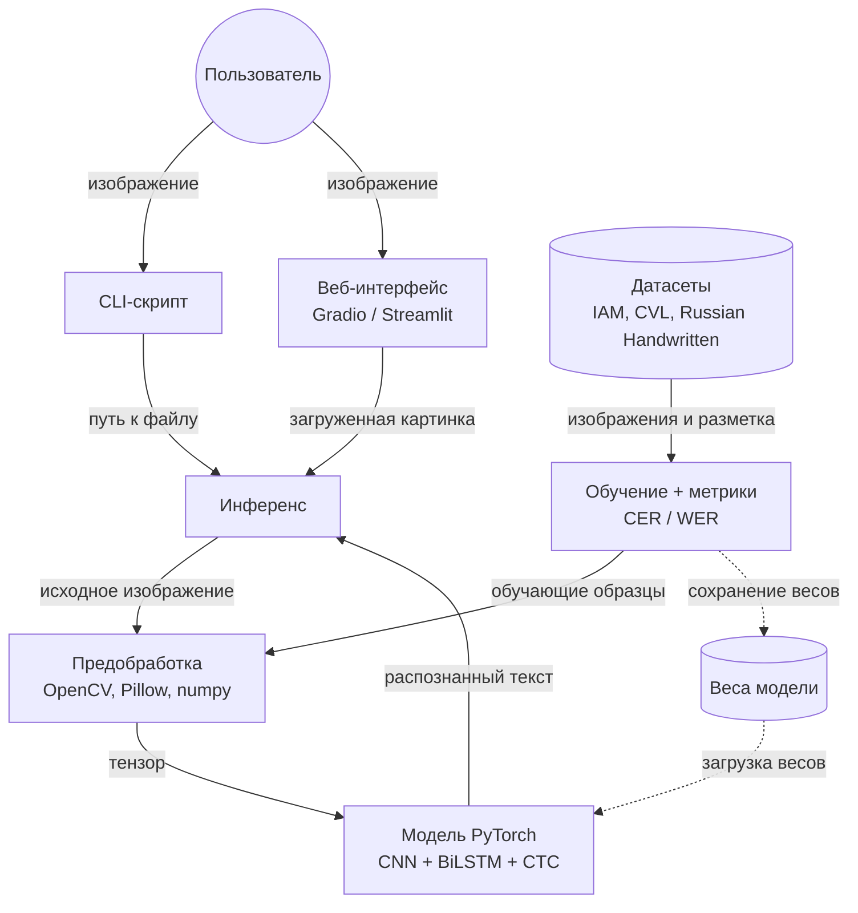
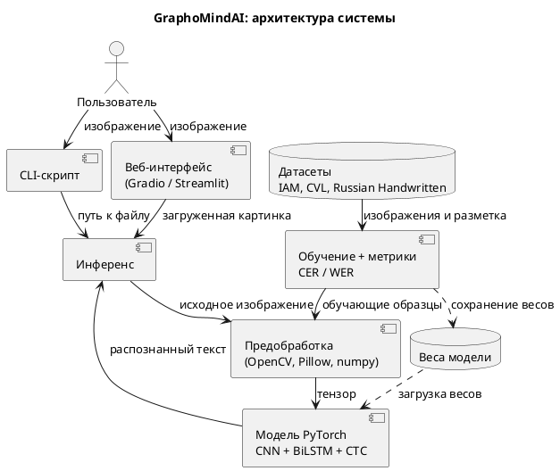

# GraphoMindAI: архитектура системы

GraphoMindAI — система распознавания рукописного текста (HTR). Пользователь загружает изображение с рукописным текстом и получает распознанный текст. Модель обучается заранее на открытых датасетах.

## Схема

Сплошная стрелка — передача данных или вызов, пунктирная — загрузка или сохранение файла. Подпись на стрелке показывает, что именно передаётся.

## Блоки

| Блок | Назначение |
|---|---|
| CLI-скрипт | Запуск из командной строки: на входе путь к изображению, на выходе текст |
| Веб-интерфейс (Gradio / Streamlit) | Страница в браузере: загрузка картинки и вывод результата |
| Инференс | Общая точка входа для распознавания, чтобы CLI и веб не дублировали логику |
| Предобработка (OpenCV, Pillow, numpy) | Приводит изображение к единому виду (размер, контраст, шум) и превращает в тензор |
| Модель (PyTorch) | CNN выделяет признаки, BiLSTM читает их как последовательность, CTC превращает её в символы |
| Обучение + метрики | Обучает модель на датасетах и считает качество по CER и WER |
| Датасеты | IAM, CVL, Russian Handwritten: изображения с правильными расшифровками |
| Веса модели | Файл с параметрами обученной модели; обучение записывает его, распознавание загружает |

## Сценарии

**Распознавание.** Пользователь даёт изображение через CLI или веб-интерфейс → инференс → предобработка → модель с загруженными весами → текст возвращается пользователю.

**Обучение.** Датасеты → блок обучения → предобработка → модель. По ходу считаются CER и WER, а в конце веса сохраняются в файл, которым пользуется распознавание.

## Словарь терминов

| Термин | Простое объяснение |
|---|---|
| HTR | Распознавание рукописного текста |
| Инференс | Использование уже обученной модели для получения результата |
| Тензор | Многомерный массив чисел; в таком виде изображение «видит» нейросеть |
| Веса | Настроенные параметры модели, результат обучения |
| Датасет | Набор данных для обучения: изображения и правильные ответы |
| Аугментация | Небольшие случайные искажения изображений при обучении, чтобы модель была устойчивее |
| CNN | Свёрточная нейросеть: находит на изображении штрихи, линии, формы букв |
| BiLSTM | Сеть, которая читает последовательность в обе стороны и учитывает соседние буквы |
| CTC | Метод, который превращает последовательность признаков в символы, не требуя заранее знать границы букв |
| CER / WER | Доля ошибок на уровне символов / слов; чем меньше, тем лучше |

Та же схема в PlantUML (для отчёта)

Код можно вставить на plantuml.com/plantuml и скачать PNG или SVG.

